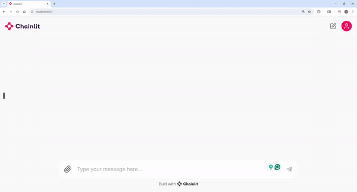
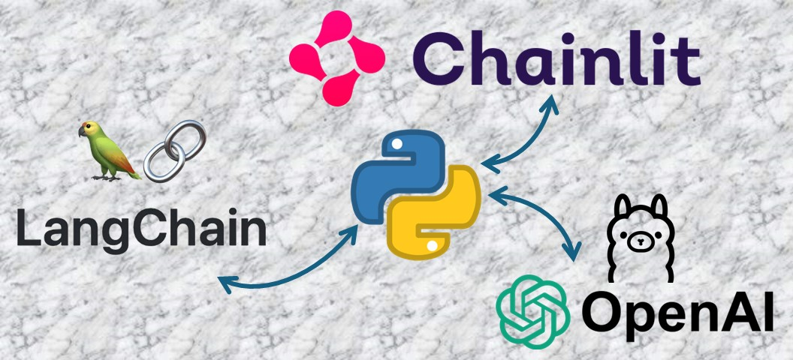

# Langchain - Gen AI - Assistant using OpenAI



## Demo


---
## Steps

### 1. Configure OpenAI API Key
Create an API key from [openai.com](https://platform.openai.com/api-keys)

### 2. Clone Git Repo
```sh
git clone https://github.com/srushtihj97/chat-assistant-langchain.git
cd ./langchain-chat-assistant
```

### 3. Create & Activate Virtual Env
```sh
sudo apt install python3.11-venv
python3 -m venv .venv
source ./.venv/bin/activate
python3 -m pip install --upgrade pip
```

### 4. Install Packages
```sh
pip install chainlit langchain_openai langchain
``` 

### 5. Run the script
```sh
chainlit run ./app/main_openai.py -w
```
`-w` flag to enable auto-reloading

Please follow instructions if you want to run local LLM from 
!(README-ollama.md)
